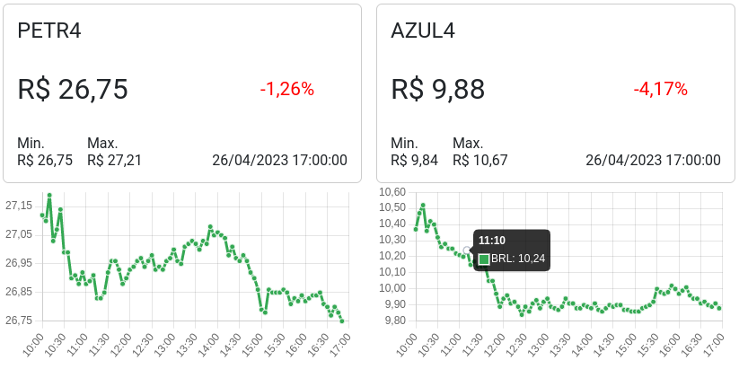

# Variação do Ativo

Projeto em Angular usa a API do Yahoo Finance para ler dados de ativos financeiros e exibir um breve resumo sobre o ativo selecionado. Além disso, ele tem uma funcionalidade de atualização automática de dados para que o usuário possa ver as informações mais recentes.

## Captura de tela



## Para exibição de novos Ativos

Basta fazer o uso do componente Stock em seu HTML da seguinte maneira:

```bash
  <app-stock symbol="azul4"></app-stock>
```

## Rodando localmente

Clone o projeto

```bash
  git clone https://link-para-o-projeto
```

Entre no diretório do projeto

```bash
  cd my-project
```

Instale as dependências

```bash
  npm install
```

Inicie o servidor

```bash
  npm run start
```

Após o processo de compilação, o projeto estará disponível em http://localhost:4200/.

## Pacotes utilizados

**date-fns:** biblioteca de utilitários para manipulação de datas em JavaScript.

**API do Yahoo Finance:** API para buscar dados de ações.
